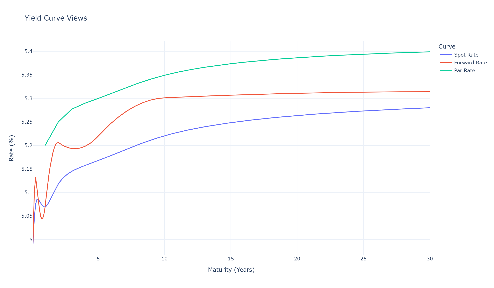
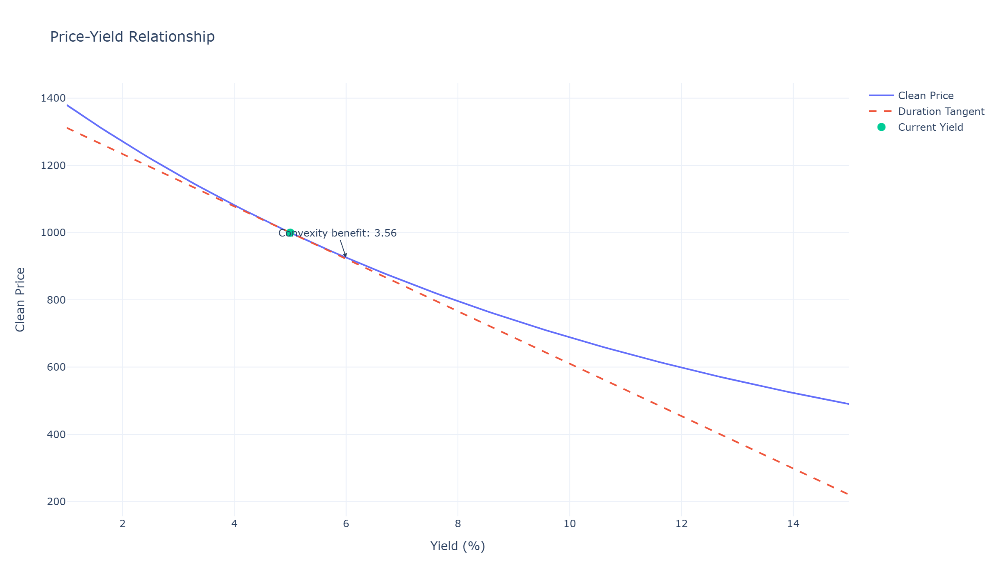
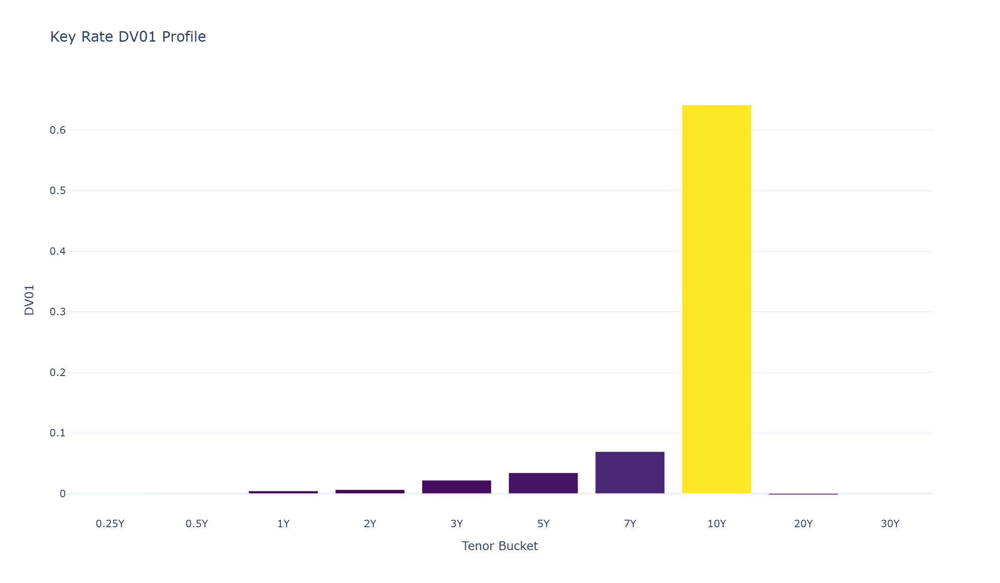
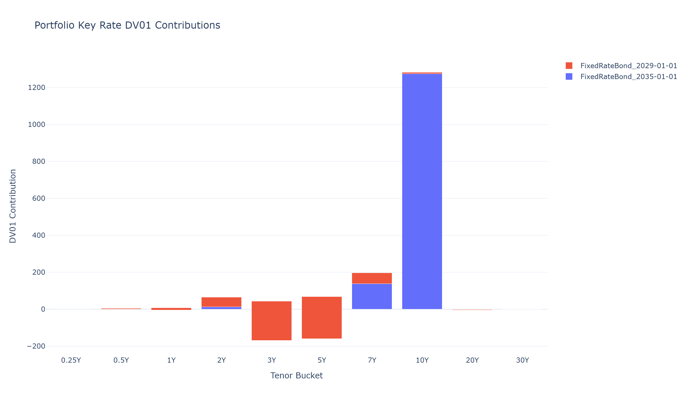

# Fixed Income Pricing Engine

Production-style Python library for bond pricing, yield-curve bootstrapping, interest-rate risk analytics, portfolio aggregation, visualizations, and a FastAPI surface for downstream integration.

## Motivation

This project is designed as a compact fixed-income analytics stack that is easy to inspect, test, and extend. It covers the core building blocks a quantitative developer typically needs for vanilla rate products:

- fixed-rate and zero-coupon bond pricing
- accrued interest and cash-flow schedule generation
- deposit and swap curve bootstrapping
- duration, convexity, DV01, and key-rate risk
- portfolio-level aggregation and hedge sizing
- Plotly visualizations and a FastAPI service layer

## Installation

```bash
python -m pip install -r requirements.txt
```

Static README chart generation was produced with `kaleido`, which is optional for runtime use.

## Quick Start

```python
from datetime import date

from fixed_income.analytics.convexity import effective_convexity
from fixed_income.analytics.duration import effective_duration, price_from_curve
from fixed_income.analytics.dv01 import dv01_from_curve
from fixed_income.bonds.bond import FixedRateBond
from fixed_income.curves.bootstrapper import Bootstrapper, MarketInstrument

instruments = [
    MarketInstrument("deposit", "1M", 0.0500, 2),
    MarketInstrument("deposit", "3M", 0.0510, 2),
    MarketInstrument("deposit", "6M", 0.0515, 2),
    MarketInstrument("deposit", "1Y", 0.0520, 2),
    MarketInstrument("swap", "2Y", 0.0525, 2),
    MarketInstrument("swap", "5Y", 0.0530, 2),
    MarketInstrument("swap", "10Y", 0.0535, 2),
    MarketInstrument("swap", "30Y", 0.0540, 2),
]

curve = Bootstrapper(instruments).bootstrap()
settlement = date(2025, 1, 1)
bond = FixedRateBond(
    face_value=1000.0,
    coupon_rate=0.05,
    issue_date=settlement,
    maturity_date=date(2035, 1, 1),
    frequency=2,
    day_count_convention="ACT/ACT",
)

price = price_from_curve(bond, curve, settlement)
duration = effective_duration(bond, curve, settlement)
dv01_value = dv01_from_curve(bond, curve, settlement)
convexity_value = effective_convexity(bond, curve, settlement)

print(price, duration, dv01_value, convexity_value)
```

## Project Structure

```text
fixed_income/
├── fixed_income/
│   ├── analytics/
│   ├── api/
│   ├── bonds/
│   ├── curves/
│   ├── portfolio/
│   ├── utils/
│   └── visualization/
├── docs/images/
├── notebooks/demo.ipynb
├── scripts/
├── tests/
└── requirements.txt
```

## Mathematical Formulas

Bond dirty price:

$$
P_{dirty} = \sum_{t=1}^{N}\frac{CF_t}{\left(1 + \frac{y}{m}\right)^{m \tau_t}}
$$

Accrued interest:

$$
AI = C \times \frac{\text{accrual fraction}}{\text{period fraction}}
$$

Deposit discount factor:

$$
DF(T) = \frac{1}{1 + r \tau}
$$

Par swap bootstrap condition:

$$
\sum_{i=1}^{n} c \alpha_i DF(t_i) + DF(T) = 1
$$

Continuously compounded spot rate:

$$
z(T) = -\frac{\ln DF(T)}{T}
$$

Forward rate:

$$
f(t_1, t_2) = \frac{\ln DF(t_1) - \ln DF(t_2)}{t_2 - t_1}
$$

Macaulay duration:

$$
D_M = \frac{\sum_t \tau_t \, PV(CF_t)}{P}
$$

Modified duration:

$$
D_{mod} = \frac{D_M}{1 + y/m}
$$

Yield DV01:

$$
DV01 = D_{mod} \times P \times 10^{-4}
$$

Effective duration:

$$
D_{eff} = \frac{P_{down} - P_{up}}{2 P \Delta y}
$$

Effective convexity:

$$
C_{eff} = \frac{P_{up} + P_{down} - 2P}{P(\Delta y)^2}
$$

Hedge ratio:

$$
N_{hedge} = \frac{DV01_{target\ change}}{DV01_{hedge\ per\ unit}}
$$

## Module Guide

`fixed_income.bonds`

- `Bond` abstract base class with cash-flow generation, accrued interest, pricing, and YTM solving
- `FixedRateBond` for plain-vanilla coupon bonds
- `ZeroCouponBond` for single-payment discount instruments

`fixed_income.curves`

- `MarketInstrument` quote representation
- `Bootstrapper` for deposit and swap zero-curve construction
- `ZeroCurve` for discount factors, spot rates, forward rates, and par rates
- linear, log-linear, and cubic-spline interpolation on log discount factors

`fixed_income.analytics`

- yield-based duration, convexity, and DV01
- curve-based effective duration, effective convexity, and DV01
- key-rate DV01 bucketing

`fixed_income.portfolio`

- signed bond positions
- aggregate market value, DV01, duration, convexity
- key-rate profile table, risk report, and hedge sizing

`fixed_income.visualization`

- yield-curve, price-yield, key-rate DV01, cash-flow, and portfolio-risk charts

`fixed_income.api`

- FastAPI endpoints for pricing, YTM, analytics, curve bootstrap, and portfolio risk

## Example Output

Example 10Y 5% semi-annual bond on the sample deposit/swap curve:

| Metric | Value |
| --- | ---: |
| Curve price | 978.487090 |
| Macaulay duration | 7.989221 |
| Modified duration | 7.794362 |
| Yield DV01 per 1000 face | 0.779436 |
| Curve DV01 per 1000 face | 0.778476 |
| Yield convexity | 73.627743 |
| Effective convexity | 72.994939 |

Sample bootstrapped zero-curve nodes:

| Tenor (Y) | Discount Factor |
| --- | ---: |
| 0.0000 | 1.0000000000 |
| 0.0833 | 0.9958506224 |
| 0.2500 | 0.9874105159 |
| 0.5000 | 0.9748964173 |
| 1.0000 | 0.9505703422 |
| 2.0000 | 0.9027031421 |
| 5.0000 | 0.7723080703 |
| 10.0000 | 0.5933062388 |
| 30.0000 | 0.2051479451 |

Sample 3-bond portfolio report:

| CUSIP/name | Notional | MV | DV01 | Duration | Convexity |
| --- | ---: | ---: | ---: | ---: | ---: |
| FixedRateBond_2035-01-01 | 2000000.0 | 1956974.18 | 1556.95 | 7.9596 | 72.9949 |
| FixedRateBond_2029-01-01 | -1000000.0 | -956398.39 | -356.52 | 3.7285 | 14.5177 |
| FixedRateBond_2038-01-01 | 1500000.0 | 1598542.27 | 1491.03 | 9.3327 | 106.4709 |

Portfolio totals from the same example:

- total market value: `2599118.062498`
- total DV01: `2691.458215`
- DV01-neutral hedge notional versus the 2038 bond: `-2707657.847692`

## Chart Screenshots

Yield-curve view:



Price-yield relationship:



Key-rate DV01 profile:



Portfolio risk by tenor:



## Demo Notebook

The full walkthrough lives in [demo.ipynb](notebooks/demo.ipynb) and covers:

1. constructing a 10Y 5% semi-annual Treasury-style bond
2. bootstrapping the sample yield curve
3. pricing the bond off the curve
4. computing duration, DV01, and convexity
5. generating the key-rate DV01 profile
6. building a 3-bond portfolio and risk report
7. computing a hedge trade to target zero DV01
8. creating all five visualization outputs

## Running Tests

Project regression:

```bash
python -m pytest tests/test_bonds.py tests/test_curves.py tests/test_analytics.py tests/test_portfolio.py tests/test_visualization.py tests/test_api.py -q -p no:cacheprovider
```

Phase-by-phase validators are available in `scripts/validate_phase_*.py`.
